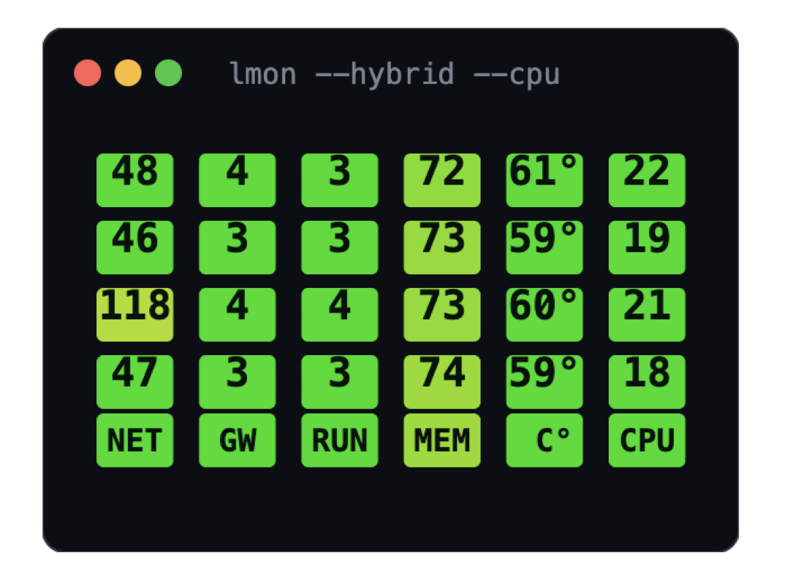
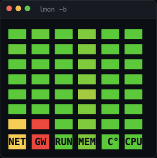
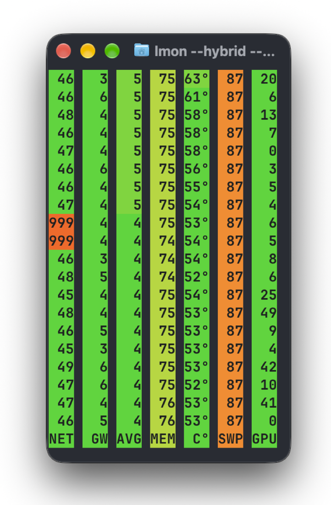
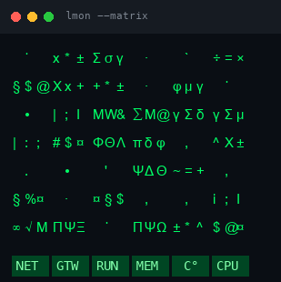
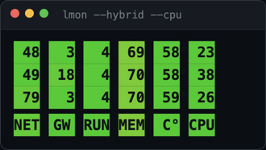
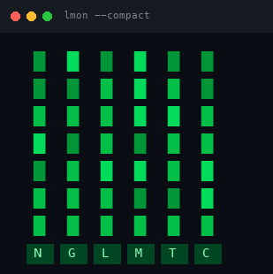

# lmon — пульс компьютера в одной строке

**Пульс компьютера — в одной строке.**

**[English](README.md)** · Русский · [Сайт с живой демкой](https://martiyanov.github.io/lmon/)

<p align="center">
  <a href="https://martiyanov.github.io/lmon/"></a>
  &nbsp;
  <a href="https://martiyanov.github.io/lmon/"></a>
  &nbsp;
  <a href="https://martiyanov.github.io/lmon/"></a>
  &nbsp;
  <a href="https://martiyanov.github.io/lmon/"></a>
</p>
<p align="center"><sub>Шесть режимов — цифры, цветные квадраты (<code>--bars</code>), гибрид (<code>--hybrid</code>), компактный (<code>--compact</code>), горизонтальный (<code>--horizontal</code>) и матрица/дождь (<code>--matrix</code>, <code>--rain</code>); значения настоящие, снятые на macOS. Окно можно ужать до ширины индикаторов:</sub></p>
<p align="center">
  <a href="https://martiyanov.github.io/lmon/"></a>
</p>

Хочется просто видеть, всё ли с компьютером в порядке — не открывая
диспетчер задач и не отдавая полэкрана графикам. lmon показывает это
одной строкой в секунду. Цвет говорит о состоянии: зелёный — всё
спокойно, жёлтый — стоит взглянуть, красный — что-то не так. Цифры
не обязательны: статус читается боковым зрением.

```
 12   2  18   1  62  55  47  12   ← значения стекаются вверх
 11   2  19   1  63  55  47  12
118   3  21   1  63  56  47  12   ← интернет «моргнул»: роутер в норме
NET GTW CPU RUN MEM  C° DSK SWP   ← лента; подложка = цвет состояния
```

Работает на macOS, Windows 10+ и Linux. Одна небольшая программа,
ничего extra ставить не нужно. Принципы проекта — в
[CONCEPT.md](CONCEPT.md): легко, мало ресурсов, честно (нет датчика —
покажет точку «·», а не выдуманное число).

### Своя колонка пинга — например, для VPN

`--ping ИМЯ=хост` добавляет колонку пинга до любого хоста (имя из 2–3
символов). Например, сервер внутри туннеля Amnezia: `--ping VPN=10.8.0.1` —
пока VPN работает, в колонке задержка; выключен — `...` в TUI (или `999` в `--once`). Можно несколько:
`LMON_PING="VPN=10.8.0.1,DNS=1.1.1.1"`.

По умолчанию колонка добавляется справа. Чтобы поставить её в нужное
место, добавь имя в `--cols`: `--cols NG,VPN,M` — пинг VPN окажется между
шлюзом и памятью. Вокруг имён пингов нужны разделители (запятая, пробел
или `+`); компактные наборы букв вроде `NGM` работают как раньше.

## Установка

### macOS

1. Открой «Терминал»: `Cmd + Пробел` → набери «Терминал» → Enter.
2. Скопируй две команды по одной (после каждой — Enter):

```sh
curl -fsSL https://github.com/martiyanov/lmon/releases/latest/download/lmon_darwin_arm64.tar.gz | tar -xz
```

```sh
sudo mv lmon /usr/local/bin/
```

Вторая команда спросит пароль от мака — набери его (при наборе пароль
не виден, это нормально).

> Старый мак на Intel? В первой команде возьми `lmon_darwin_amd64.tar.gz`.

Есть Homebrew? Тогда всё в одну команду: `brew install martiyanov/tap/lmon`.

### Windows 10/11

1. Правый клик по «Пуск» → «Терминал» (или PowerShell).
2. Скопируй по очереди:

```powershell
curl.exe -fsSL -o lmon.zip https://github.com/martiyanov/lmon/releases/latest/download/lmon_windows_amd64.zip
```

```powershell
Expand-Archive lmon.zip
Move-Item lmon\lmon.exe "$env:LOCALAPPDATA\Microsoft\WindowsApps" -Force
```

3. Набери `lmon` и жми Enter.

> На Windows колонки RUN, C° и IOW скрываются автоматически — этих данных
> в системе нет. SWP читает файл подкачки через PDH (без админа), GPU/G° —
> через NVIDIA NVML/nvidia-smi или счётчики PDH GPU Engine (другие вендоры).
> Для температуры CPU нужен внешний источник: `--temp-cmd '<команда>'`
> (например, LibreHardwareMonitor через PowerShell). При старте lmon пишет,
> что скрыто или недоступно и как это исправить; подсказки не блокируют
> запуск и отключаются флагом `--no-hints`.

> Синее окно SmartScreen — стандартное предупреждение о незнакомой
> программе: «Подробнее» → «Выполнить в любом случае». Код открыт:
> [github.com/martiyanov/lmon](https://github.com/martiyanov/lmon).

### Диагностика на Windows

Если колонка показывает `·` или `999`, выполни в PowerShell и приложи вывод к отчёту:

```powershell
lmon --version
lmon --once --cols NGSPH --swap --gpu --gputemp

# проверить, что --temp-cmd работает (ожидается 55)
lmon --once --cols T --temp-cmd "echo 55"

# swap / файл подкачки
Get-CimInstance Win32_PageFileUsage | Select-Object Name, AllocatedBaseSize, CurrentUsage

# сеть и шлюз
ping -n 2 -w 1000 8.8.8.8
(Get-NetRoute -DestinationPrefix 0.0.0.0/0 | Sort-Object RouteMetric | Select-Object -First 1).NextHop

# GPU: инструменты NVIDIA, затем счётчики WDDM (любой вендор)
nvidia-smi --query-gpu=temperature.gpu,utilization.gpu --format=csv,noheader
Get-Counter '\GPU Engine(*)\Utilization Percentage' -ErrorAction SilentlyContinue

# давление на диск (имена счётчиков в неанглийской Windows локализованы)
typeperf "\PhysicalDisk(_Total)\Avg. Disk Queue Length" -sc 3
typeperf "\PhysicalDisk(_Total)\Avg. Disk sec/Read" -sc 3

# источники температуры CPU (опционально; часто нужен админ и/или не поддерживается)
Get-CimInstance -Namespace root/wmi -ClassName MSAcpi_ThermalZoneTemperature
```

Что означают значения:

- **`SWP`** — занятость файла подкачки, %. `·` — файл подкачки отключён или не читается: включи в `sysdm.cpl` → Дополнительно → Быстродействие → Виртуальная память.
- **`GPU`** — NVIDIA через NVML/nvidia-smi, AMD/Intel через счётчики PDH GPU Engine; `·` — нет драйвера/источника.
- **`G°`** — пока только NVIDIA; для AMD/Intel нужен внешний монитор.
- **`C°`** — штатного API в Windows нет; передай `--temp-cmd` (LibreHardwareMonitor, HWiNFO, ACPI WMI — любая команда, печатающая °C).
- **`NET`/`GTW = 999`** — ICMP-эхо не проходит; подсказка при старте покажет правило файрвола и варианты `--target`/`--gw`.
- **`RUN` и `IOW`** на Windows скрыты намеренно: в системе нет load average и iowait.

Ещё укажи версию Windows, вендора GPU и есть ли `nvidia-smi` — этого достаточно, чтобы воспроизвести большинство отчётов.

### Linux

Debian/Ubuntu: `curl -fsSLO .../lmon_amd64.deb && sudo dpkg -i lmon_amd64.deb`
(полная команда в [английском README](README.md)). Остальные
дистрибутивы: curl + tar, как на маке.

## Проверка

```sh
lmon 5      # пять строк и выход — значит, работает
lmon help   # вся справка: при русской локали — по-русски,
            # иначе lmon --lang ru help (или lmon help ru)
```

## Что означают колонки

По умолчанию: **NET GTW CPU RUN MEM C° DSK SWP**; дополнительные колонки — по флагам.

Простыми словами:

- **NET** — как быстро отвечает интернет (пинг до 8.8.8.8), в миллисекундах.
- **GTW** — как быстро отвечает твой роутер. Вместе с NET помогает понять,
  где проблема: обе красные — плохо дома (Wi-Fi, роутер, кабель);
  красный только NET — плохо у провайдера.
- **RUN** — сколько программ в среднем стоит в очереди к процессору
  (это классический «load average»). Цвет считается по числу ядер
  конкретной машины: пока очередь не длиннее числа ядер — зелёный,
  до двух ядер очереди — жёлтый, дальше красный. Пороги любой колонки
  можно задать свои: `--thresholds NET=100/200/500,RUN=8/16/32` —
  удобно, например, на мобильном интернете. На Windows такого
  показателя нет — колонка скрывается.
- **MEM** — сколько занято памяти, %. Красная MEM и растущий SWP — памяти
  не хватает, всё начинает тормозить.
- **C°** — температура процессора. Выше 80–90 °C — перегрев.
- **CPU** — насколько процессор занят прямо сейчас, %.
- **IOW** — сколько процессор простаивает в ожидании диска (`--iowait`,
  только Linux; высокий — диск узкое место; на macOS/Windows скрыта).
- **SWP** — занятый swap/файл подкачки; растёт при нехватке памяти. На Windows читается через PDH без прав администратора.
- **FAN** — скорость вентиляторов, % (`--fans`; Linux: PWM hwmon + вентилятор NVIDIA GPU; в других ОС нужны внешние утилиты).
- **GPW** — потребление GPU, Вт (`--gpu-power`; Linux/NVIDIA).
- **NVM** — температура NVMe, °C (`--nvme`; Linux).
- **LAT/QUE** — латентность диска (мс) и очередь I/O (`--disk-io`; Linux).
- **RX/TX/ERR** — сеть, приём/передача и ошибки (`--net-rate`; Linux/macOS).
  До 1000 — КБ/с; `M` — МБ/с, `G` — ГБ/с.
- **DR/DI** — диск и IOPS (`--disk-rate`; macOS).
  `DR`: МБ/с, крупнее в G/T; `DI`: IOPS, крупнее в K/G.
- **MPS** — давление памяти: 0 normal, 1 warning, 2 critical (`--pressure`; macOS).
- **PSI** — давление на память, avg10 % (`--psi`; Linux).
- **SVC/UPD** — упавшие systemd-юниты и флаг перезагрузки (`--system`; Linux).
- **PWR/WEA** — потребление CPU (RAPL) и износ NVMe (SMART), `--cpu-power`/`--nvme-smart`; Linux, нужен root.
- **I/O** — насколько занят диск, % (`--disk-busy`; Windows читает
  `\PhysicalDisk(_Total)\% Disk Time` через PDH, macOS считает из IOKit
  `Total Time (Read/Write)`; без админа). Ближайший аналог Linux-iowait.
- **DSK** — насколько заполнен системный диск; выше 90% — пора чистить.
- **BAT** — заряд батареи (`--batt`; красный ниже 20%).
- **GPU** — занятость видеокарты, % (`--gpu`). Windows: NVML/nvidia-smi (NVIDIA) или счётчики PDH GPU Engine (остальные). Несколько карт: `--gpu-list` покажет индексы; `--gpu-index N` выберет одну для `GPU`/`G°`, а `--gpu-index 0,1 --gpu --gputemp` добавит по колонке на карту (`G0/G1`, `T0/T1`).
- **G°** — температура видеокарты (`--gputemp`; на Windows NVIDIA — через
  NVML/nvidia-smi, AMD/Intel — только внешний монитор).

`...` в TUI (или `999` в `--once`; с `--symbols` — тоже `...`) — хост не отвечает, `·` — датчик есть, но сейчас недоступен
(например TMP без `smctemp`), `+++` — число не влезло в колонку.
Колонки, которых в ОС нет вовсе, скрываются автоматически — при старте
lmon пишет, что скрыто и чем заменить; отключить подсказки: `--no-hints`.

По умолчанию: NET GTW CPU RUN MEM C° DSK SWP — сеть, процессор, память,
температура и диск. GPU, вентиляторы, батарея и I/O — по флагам.

### JSON, коды выхода и процессы

Для скриптов и cron:

```sh
lmon --once --json
lmon --once --exit-code
lmon --top 10
```

JSON — один объект на замер; `state` бывает `ok`, `warning`, `critical`,
`no_sensor`, `no_reply`, а `value` для отсутствующих данных — `null`.
`--exit-code` работает только с `--once`: 0 — норма, 1 — warning,
2 — critical. `--top` пока только Unix.

Пресеты колонок:

```sh
lmon --profile server
lmon --profile desktop
lmon --profile network
```

Явный `--cols` или `cols` из конфига важнее профиля.

### Без цвета

Цвет отключается через `NO_COLOR=1 lmon` или `--mono`. В `--compact` и
`--bars` lmon автоматически переходит на монохромную шкалу заполнения:

```
· → ░ → ▒ → ▓ → █
```

Нет датчика — `?`/`???`, нет ответа — `!`/`!!!`. Отдельного `--no-color`
пока нет: используйте `NO_COLOR=1` или `--mono`.

### Конфиг

```sh
lmon --save-config
lmon --config ./lmon.conf --once
lmon --no-config
```

Файл — `key=value`; путь по умолчанию `$XDG_CONFIG_HOME/lmon/config` или
`~/.config/lmon/config` (Windows: `%AppData%\lmon\config`), переопределяется
`LMON_CONFIG`. Приоритет: CLI > конфиг > переменные окружения > дефолты.

```ini
cols=NGCLMTUS
interval=1
no-hints=true
ping=VPN=10.8.0.1
```

Шесть режимов отображения: цифры (`lmon`), цветные квадраты (`--bars`),
цифры на цветной подложке (`--hybrid`), компактный (`--compact`),
горизонтальный (`--horizontal`) и матрица (`--matrix`, `--rain`).

Реальные рилсы: [русский](media/reel-benefit-ru.mp4) · [английский](media/reel-benefit-en.mp4) · [тизер про матрицу](media/reel-matrix.mp4).

Одноколоночный режим — `lmon --compact`: по одной букве на параметр в
заголовке и по одному блоку `█` на значение, без промежутков. Заголовок
берёт буквы из `--cols`; у пингов и многобуквенных колонок — первый символ.
Можно совмещать: `lmon --compact --matrix` (шифрованные символы) и
`lmon --rain --compact` (падение вниз). Фиолетовый — датчика нет,
ярко-красный — нет ответа.



`--mono` — ч/б заполнение без цвета: `lmon --mono --bars`, `lmon --mono --compact`.

`--matrix` — стиль для любого режима: зелёный цвет и шифрованные символы
вместо цифр. При старте выбирается случайный срез безопасного набора
одноклеточных символов. В обычной сетке значение — три разных символа;
нулевой уровень — случайный маленький символ по центру (`·`, `.`, `,`,
`'`, `` ` ``, `˙`, `∙`). В `--compact` и `--horizontal` — один символ;
`--rain` сохраняет ширину выбранного режима.

`--resize-window` держит все заголовки в одной строке и распределяет
ширину терминала между колонками. Никаких переносов на 3/1 колонки:

- широкая клетка — полные имена (`Network`, `Gateway`, `Memory`…);
- средняя — короткие (`NET`, `GTW`, `CPU`…);
- очень узкая — однобуквенные (`N`, `G`, `C`…).

Направление значений зависит от ключей:

- обычный режим — заголовок снизу, значения идут вверх;
- `--rain` — заголовок сверху, значения идут вниз;
- `--horizontal` — заголовок сверху, в каждой колонке горизонтальная
  лента последних значений (вбок).

`--bars`/`--blocks` заливают цветом всю ячейку, `--hybrid` — весь фон
ячейки. Только TUI; с `--once` не сочетается.

```sh
lmon --resize-window
lmon --rain --resize-window
lmon --horizontal --resize-window
```

`--rain` — только направление: заголовок сверху, новые значения появляются
под ним и падают вниз. Символы и цвета те же, что в выбранном режиме:

```sh
lmon --rain --matrix
lmon --rain --bars
lmon --rain --compact
```

`--rain` не сочетается с `--horizontal` и `--once`.

`lmon --horizontal` — горизонтальный цветной режим: один параметр на строку,
время идёт вправо, каждая клетка — цветной блок, без цифр. Новые замеры слева,
старые уезжают вправо. `--labels full` — полные подписи (`Network`, `Memory`,
`CPU temp`), по умолчанию короткие буквы из `--cols`. Показываются только
строки, поместившиеся по высоте. Работает только в TUI; `--once` не меняется
и с `--horizontal` не сочетается.

В TUI закреплённый заголовок всегда показывает **текущий** замер, а строка
данных прямо над ним — на один замер старше. Поэтому цвет сначала появляется
в заголовке и на следующем тике уходит вверх, а не загорается одновременно
в заголовке и в ячейке над ним. `--once` не меняется.

Набор и порядок колонок — любые: `lmon --cols NRMC` (буквы — в `lmon help`). Занятость диска: `lmon --disk-busy` (колонка `I/O`; Windows — PDH, macOS — IOKit, без админа). Несколько GPU: `lmon --gpu-list`, затем `lmon --gpu --gputemp --gpu-index N` (одна карта) или `--gpu-index 0,1` (по колонке на каждую). Пустой столбик-разделитель: две запятые подряд — `lmon --cols NG,,M`. Всё сразу: `lmon --all` (все доступные колонки, плюс `--ping`; с `--cols` не сочетается). Вентиляторы: `lmon --fans` (Linux: PWM hwmon + GPU) или `--fans-all` (по колонке на каждый). Root-метрики: `sudo lmon --cpu-power --nvme-smart` (без root — `·` и подсказка).
Одна строка значений для tmux-статусбара: `lmon --once` (цвет — только на терминале, в пайп идёт чистый текст). Температура CPU на Windows — через `--temp-cmd` (LMON_TEMP_CMD): команда печатает °C, lmon берёт первое число.

## FAQ

**Спросил пароль (`sudo`) — это что?** Твой пароль учётной записи; не
отображается при вводе — так устроено. Нужен, чтобы положить программу
в системную папку.

**«command not found» после установки.** Закрой терминал и открой заново.
Не помогло — прогони установку ещё раз и посмотри красные ошибки.

**Хочу температуру процессора на macOS.** Поставь маленькую утилиту
smctemp: https://github.com/holtmann/osx/tree/master/smctemp — без неё
в колонке C° будет точка.

**Первая строка подозрительно большая.** Wi-Fi «просыпается» при старте;
со второй строки — честные числа.

## Как удалить

macOS/Linux: `sudo rm /usr/local/bin/lmon` (или
`brew uninstall martiyanov/tap/lmon`).
Windows: удали `lmon.exe` из `C:\Users\<имя>\AppData\Local\Microsoft\WindowsApps`.

## Сообщество

- **GitHub Discussions** — идеи, вопросы, настройки, анонсы релизов: https://github.com/martiyanov/lmon/discussions
- Правила и путь идеи до фичи: [COMMUNITY.md](COMMUNITY.md)
- Баги и конкретные задачи: [Issues](https://github.com/martiyanov/lmon/issues)
- Об уязвимостях — приватно через [Security → Report a vulnerability](https://github.com/martiyanov/lmon/security/advisories/new)

Русский и английский — оба языка OK. Ответы, которые важно сохранить, остаются в Discussions — их можно найти поиском; ссылки на чат Matrix/Telegram появятся здесь после создания комнаты и канала.

## Лицензия

MIT — используй и меняй свободно. Код:
[github.com/martiyanov/lmon](https://github.com/martiyanov/lmon).
